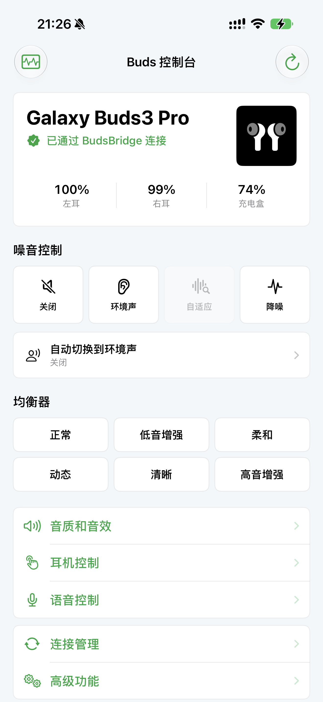

# BudsControl

BudsControl is an unofficial iOS, Android, and Windows controller for Galaxy Buds3 Pro, built for people who want the useful Galaxy Wearable controls without owning a Samsung phone. It reproduces the useful parts of Samsung's One UI settings screen and keeps the last successfully applied settings locally.



The original iOS control path has been tested on a physical SM-R630. The earbuds acknowledged noise-control and equalizer commands, and the app read the left, right, and case battery levels. iOS 0.2.0 adds protocol-mapped controls that still need a second physical-earbud validation pass. Android 0.1.0 and Windows 0.1.0 implement the same controls over direct Bluetooth Classic connections and currently remain hardware-validation previews.

## Platforms

| Platform | Control path | Release status |
| --- | --- | --- |
| iOS 18+ | iPhone -> encrypted local bridge -> Mac RFCOMM -> Buds3 Pro | Core controls hardware verified; extended 0.2.0 controls pending |
| Android 8+ | Android phone -> Bluetooth Classic RFCOMM -> Buds3 Pro | 0.1.0 preview; simulator and protocol tests passed, physical earbuds pending |
| Windows 10 2004+ | Windows PC -> Bluetooth Classic RFCOMM -> Buds3 Pro | 0.1.0 preview; build and 19 protocol/transport tests passed, Windows hardware pending |

The Android and Windows clients do not need a Samsung phone, Samsung account, Mac bridge, or cloud service. Both connect only to an already paired Galaxy Buds device; neither performs a location-based discovery scan.

## Working features

| Feature | Status |
| --- | --- |
| Active noise cancelling | Hardware verified |
| Ambient sound | Hardware verified |
| Noise control off | Implemented with the same verified command path |
| Normal, bass, soft, dynamic, clear, and treble EQ presets | Hardware verified |
| Left, right, and case battery | Read from Samsung status packets |
| Mac discovery | Bonjour on the local network |
| Bridge authentication | TLS 1.2 PSK with a rotating 128-bit secret |
| CoreBluetooth diagnostics | Manual, read-only probe with exportable logs |
| Adaptive noise control | Protocol mapped; physical validation pending |
| Ambient level and left/right customization | Protocol mapped; physical validation pending |
| Voice detect, timeout, and one-ear noise control | Protocol mapped; physical validation pending |
| Touch lock, gesture toggles, long-pinch actions, and noise cycles | Protocol mapped; physical validation pending |
| Stereo balance, seamless connection, call path, and sidetone | Protocol mapped; physical validation pending |
| Fit test and Find My Earbuds | Protocol mapped; physical validation pending |
| Remember last settings | Stored locally after a successful command; corrected by live earbud state |
| Offline demo and command report | Exercises every screen without hardware and exports packet/result logs |

Blade Light writes, 9-band custom EQ, firmware updates, Samsung account services, and compound voice-model settings remain unavailable. The app can read several of these values from the earbuds, but it does not send guessed payloads. Adaptive volume and siren detection are behind an explicit experimental-command switch because only their message IDs are currently corroborated.

## Why the Mac bridge exists

Galaxy Buds3 Pro exposes its settings protocol through Bluetooth Classic SPP/RFCOMM. A normal iOS app cannot open an arbitrary RFCOMM service with Apple's public SDK. CoreBluetooth only helps when a device exposes a suitable GATT service, and ExternalAccessory requires manufacturer participation in Apple's accessory program.

BudsBridge handles the RFCOMM connection on macOS. The iPhone discovers the bridge with Bonjour and sends encrypted local-network requests. The Mac must remain awake while the controls are in use.

```text
iPhone app == TLS-PSK over LAN ==> BudsBridge == RFCOMM channel 27 ==> Buds3 Pro
```

Android exposes the Bluetooth Classic RFCOMM API to normal applications, so its connection path is direct:

```text
Android app == Bluetooth Classic RFCOMM ==> Buds3 Pro
```

Windows desktop applications can also open the RFCOMM service of an already paired device:

```text
Windows app == Bluetooth Classic RFCOMM ==> Buds3 Pro
```

## Install

### iOS

Requirements:

- Xcode 16 or newer
- iOS 18 or newer
- macOS 14 or newer
- Galaxy Buds3 Pro paired with the Mac
- iPhone and Mac on the same local network

Open `BudsControl.xcodeproj` in Xcode. Select the `BudsBridge` scheme, choose `My Mac`, and run it. The Xcode console prints a 32-character pairing secret. Copy it to the iPhone with Universal Clipboard or another local method.

Switch to the `BudsControl` scheme, choose the iPhone, select a development team if Xcode asks, and run. Allow local-network access, then enter the code shown by BudsBridge. The controls unlock after the Mac opens the Samsung RFCOMM channel.

The project is generated with [XcodeGen](https://github.com/yonaskolb/XcodeGen). After editing `project.yml`, regenerate it with:

```sh
xcodegen generate
```

### Android

Download the Android preview APK from the [Android 0.1.0 GitHub release](https://github.com/xiaoxuesheng123467/BudsControl/releases/tag/android-v0.1.0), or build it from `Android/` with Android Studio. Pair the Buds3 Pro in Android system Bluetooth settings before opening BudsControl, grant the Nearby devices permission, then select the paired earbuds in the app.

The downloadable APK is a preview build signed for direct testing. Android may require the preview build to be uninstalled before a future store-signed build can be installed. See [Android/README.md](Android/README.md) for build, permission, and validation details.

### Windows

Download the Windows preview ZIP from the [Windows 0.1.0 GitHub release](https://github.com/xiaoxuesheng123467/BudsControl/releases/tag/windows-v0.1.0). It requires 64-bit Windows 10 version 2004 or newer and the .NET 9 Desktop Runtime. Pair the Buds3 Pro in Windows Bluetooth settings first, extract the complete ZIP, then run `BudsControl.exe` and select the paired earbuds.

The Windows client is a framework-dependent, unsigned WPF preview. Its protocol, framing, ACK, timeout, and settings helpers pass 19 automated tests, but the WPF runtime and RFCOMM path still require a Windows PC with a physical SM-R630. See [Windows/README.md](Windows/README.md) for build and validation details.

## Validation

The packet verifier checks the CRC and byte layout for the hardware-verified commands and prints every newly mapped command packet:

```sh
xcrun swiftc BudsControl/Sources/BudsProtocol.swift Tools/ProtocolVerifier/main.swift -o /tmp/BudsProtocolVerifier
/tmp/BudsProtocolVerifier
```

Build both targets without signing:

```sh
xcodebuild -project BudsControl.xcodeproj -scheme BudsBridge build CODE_SIGNING_ALLOWED=NO
xcodebuild -project BudsControl.xcodeproj -scheme BudsControl -sdk iphoneos build CODE_SIGNING_ALLOWED=NO
```

Build and test Android:

```sh
cd Android
./gradlew clean testDebugUnitTest assembleDebug lintDebug
```

Build and test Windows with .NET 9:

```powershell
dotnet restore Windows/BudsControl.slnx
dotnet test Windows/BudsControl.Tests/BudsControl.Tests.csproj -c Release
dotnet build Windows/BudsControl.slnx -c Release
```

The bridge also contains a local TLS probe for development builds:

```sh
BudsBridge --probe-port <port> --pairing-code <secret>
```

Its protocol self-test validates the Objective-C command allowlist, packet bytes, and rejection cases without connecting earbuds:

```sh
BudsBridge --protocol-self-test
```

## Hardware validation in 0.2.0

Open **验证中心** in the iPhone app. Offline demo mode exercises the complete UI without a Mac or earbuds. With real hardware connected, each command is logged as either `耳机 ACK`, `已写入`, or `失败`, together with its full packet. Export the report after testing so an uncertain mapping can be fixed without repeating every control.

The app remembers settings only after a command succeeds. On the next launch it shows those saved values immediately, then replaces individual fields when BudsBridge receives a newer extended-status packet from the earbuds. It does not blindly replay every setting on reconnect.

Android has the same **验证中心** flow. Its offline mode exercises all pages and exports the exact RFCOMM packet log. On a real phone, a setting is saved only after the command is acknowledged or successfully written; a later earbud status packet corrects the saved value. Android 0.1.0 has not yet been connected to a physical Buds3 Pro, so its direct transport and all command mappings remain explicitly pending hardware validation.

Windows uses the same validation order and result labels. The Windows build and 19 automated protocol/transport tests pass, but WPF startup, the Bluetooth adapter path, and every real-earbud command remain explicitly pending until tested on Windows hardware.

## Protocol notes

Samsung messages use the frame below. CRC is CRC-16/CCITT with polynomial `0x1021` and initial value `0`, calculated over the message ID and payload.

```text
FD | size (little endian) | message ID | payload | CRC16 (little endian) | DD
```

The implementation was written for this project from observed protocol behavior and published protocol documentation. [GalaxyBudsClient](https://github.com/timschneeb/GalaxyBudsClient) commit `dce4735d76cd16abb818cdd96bf458efd4abef47` was an important reference for service UUIDs and message semantics. No source file from that GPL-3.0 project is included here.

Samsung's official Buds3 Pro manual and compatibility notes describe the original controls and the lack of Buds3 Pro support in Samsung's iOS app:

- [Galaxy Buds3 Pro user manual](https://downloadcenter.samsung.com/content/UM/202410/20241031153230962/R530_R630_UG_CA_ENG_D4.pdf)
- [Samsung iOS compatibility guidance](https://www.samsung.com/us/support/answer/ANS10001319/)

## Security and privacy

BudsBridge accepts TLS-PSK connections only. It generates a 128-bit random pairing secret for each run, derives a 256-bit key with SHA-256, and restricts the TLS session to an authenticated PSK cipher. The HTTP layer checks the same secret and limits request sizes and timeouts.

Neither app has analytics or a cloud backend. See [PRIVACY.md](PRIVACY.md) for locally stored settings, permissions, and optional diagnostic logs.

## License and trademark

The source code is available under the MIT License. Galaxy Buds, Galaxy Wearable, Samsung, and One UI are trademarks of Samsung Electronics. This project is independent and is not endorsed by Samsung or Apple.
